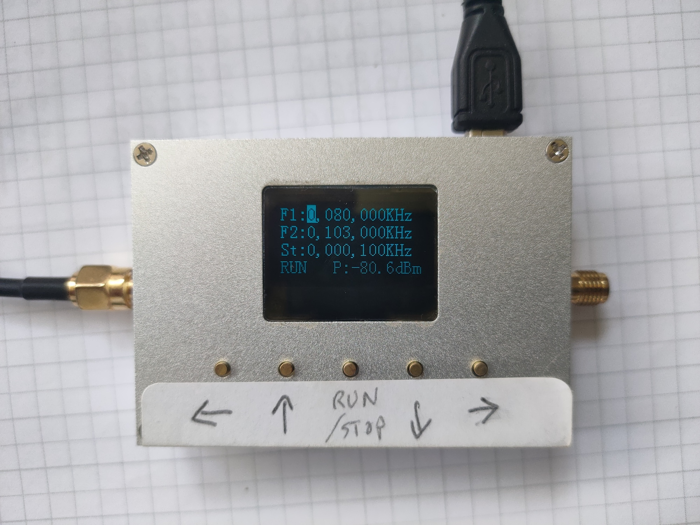

# RF-3000 Spectrometer - Python code
Python code for the low-cost RF-3000 Spectrum analyser.

https://www.ebay.co.uk/itm/353054396029



# Prerequisites
The code relies on the Pyserial module.

# Command Line Interface

This handy little spectrum analyzer came with a big lump of Windows code. Rather than run it in a VM, I wrote a bit of Python to capture the data that it spits out over USB.

The program spectrometer.py takes the following parameters

- port = e.g. /dev/cu.usbserial-14120 on a Mac, COM1 on Win etc.
- start frequency in MHz
- end frequency in MHz
- step in MHz
- output file for data in CSV format, columns: f and db

For example:

```
% python3 spectrometer.py /dev/cu.usbserial-14120 80 103 0.1 test.csv
```

The program now automatically sets the start, end and step frequencies on the spectrometer and then tells it to do a single sweep.

```
si@Sis-Mac cli % python3 spectrometer.py /dev/cu.usbserial-14120 80 103 0.1 test.csv
Expecting 230 readings
Connecting to: /dev/cu.usbserial-14120
Connected to Spectrometer
80.0,-78.000801
80.1,-78.600802
80.19999999999999,-80.800803
80.29999999999998,-83.100804
80.39999999999998,-80.700805
.... lines omitted
102.69999999999871,-80.201028
102.7999999999987,-81.101029
102.8999999999987,-83.10103
Read 230 readings.
Now open test.csv in your favorite spreadsheet
si@Sis-Mac cli % 

```

Enjoy!